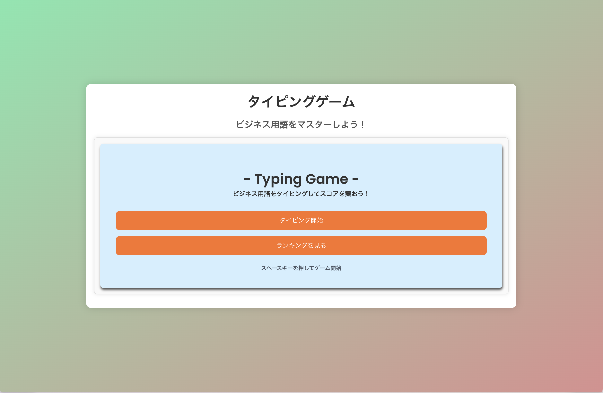
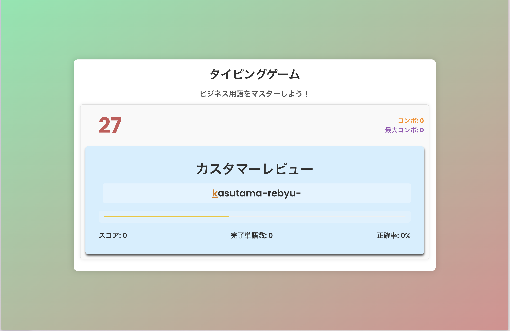
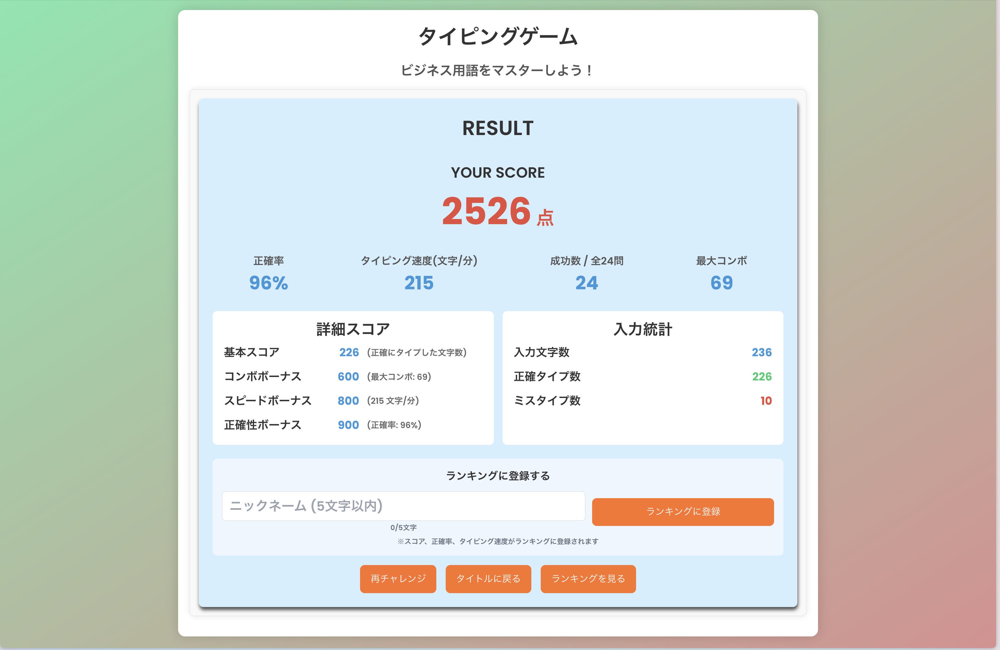
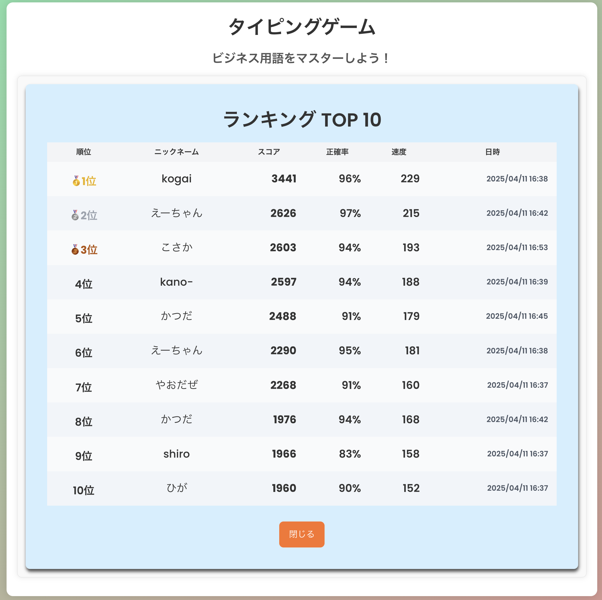
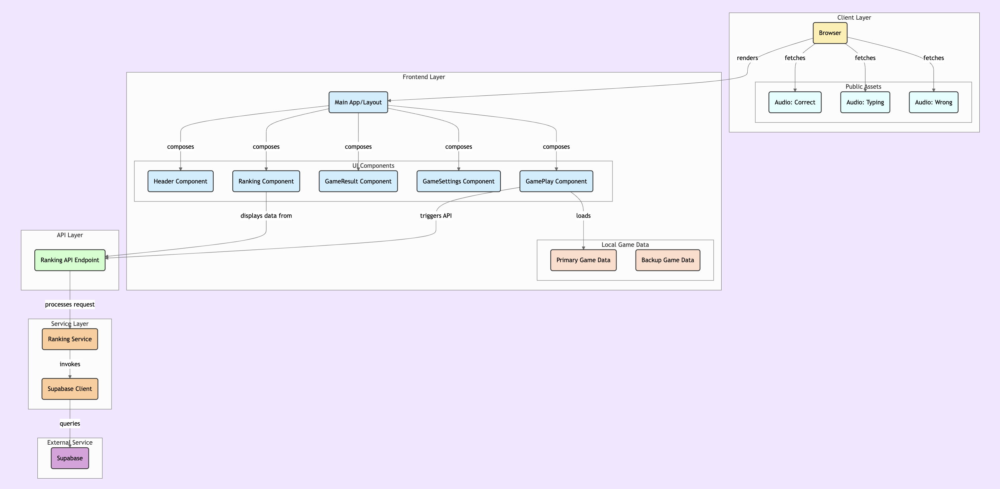

# タイピングゲーム

ビジネス用語をマスターしよう！日本語のビジネス用語をローマ字でタイピングして、スコアを競うWebアプリケーションです。

## URL

https://typing-game-business.vercel.app/

## スクリーンショット

| ホーム画面 | プレイ画面 |
|:---:|:---:|
|  |  |

| 結果画面 | ランキング |
|:---:|:---:|
|  |  |

## 機能

- ビジネス用語のタイピング練習
- スコア・正確率・タイピング速度の計測
- コンボシステム（連続正解でボーナス）
- 単語ごとの制限時間
- オンラインランキング機能（TOP 10）

## 技術スタック

| カテゴリ | 技術 |
|---------|------|
| フロントエンド | Next.js 15, React 19, TypeScript, Tailwind CSS |
| データベース | Supabase |
| ホスティング | Vercel |

## システム構成



## ローカル開発

```bash
npm install
npm run dev
```
